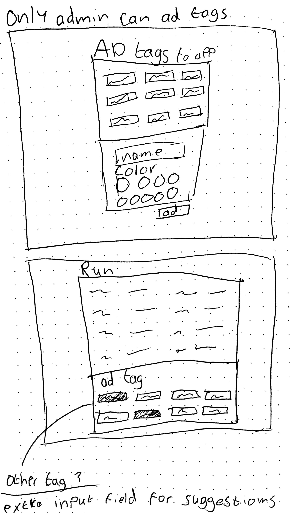
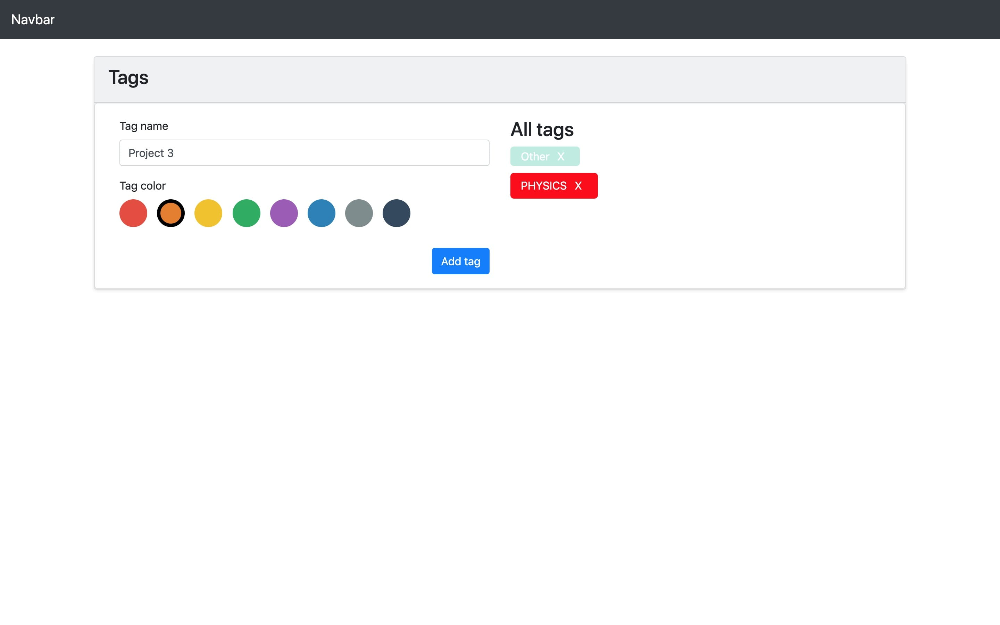
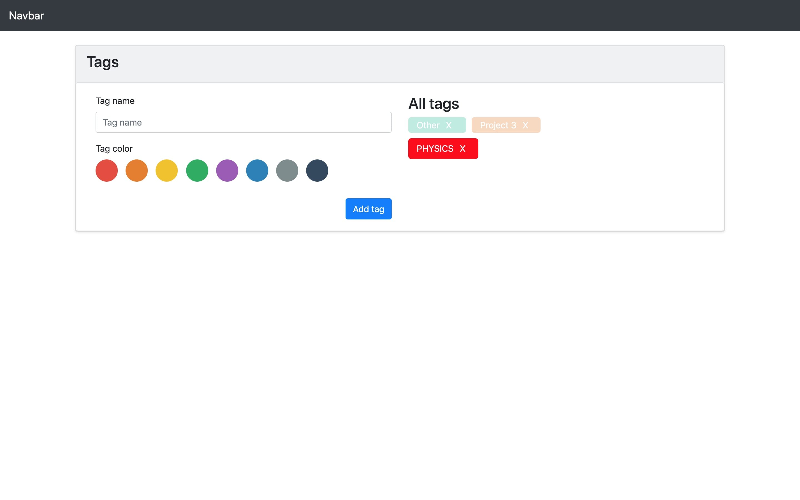
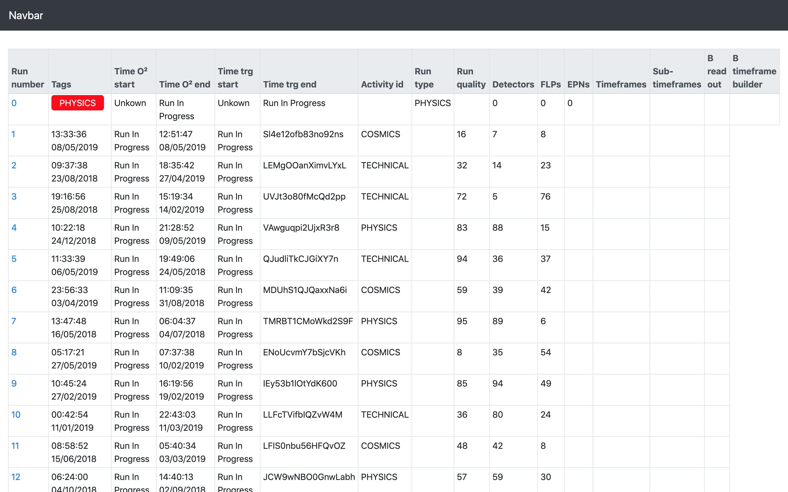
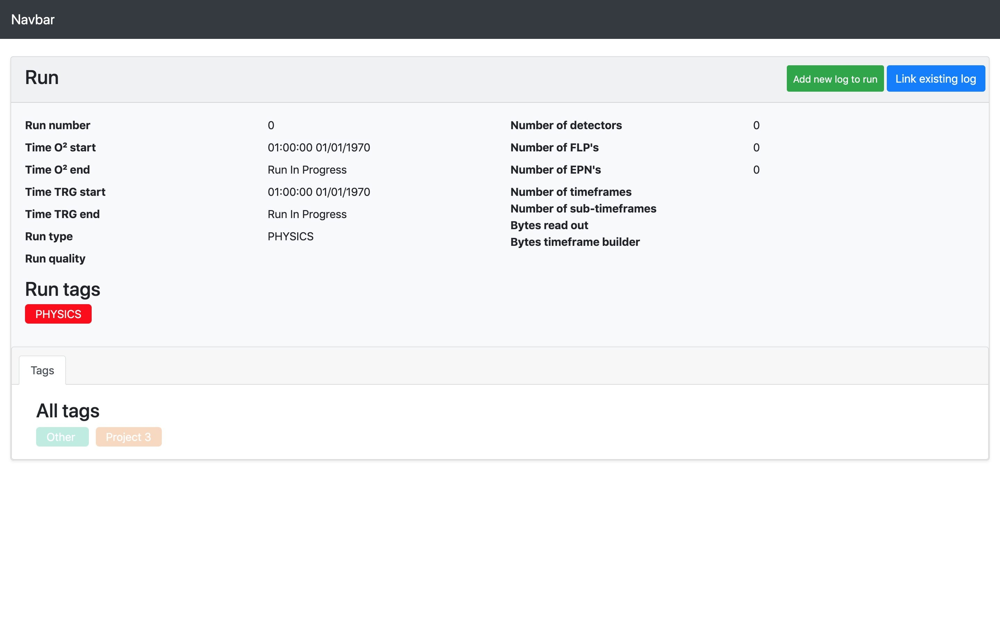
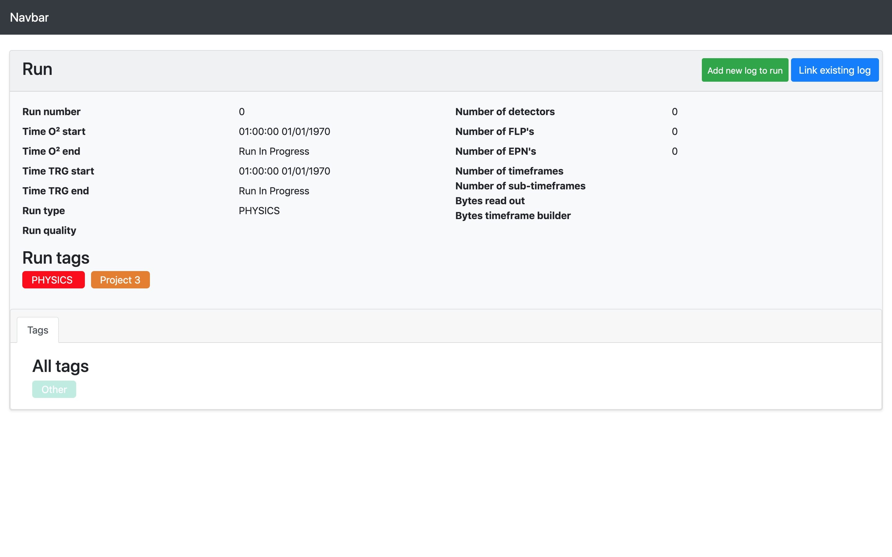

# README project 3 - CERN

## De case
Create simple UI for editing tags

ALS Gebruiker WIL IK een simpele maar gebruiksvriendelijke manier om tags te maken en aan te passen  
ZODAT Logs of threads gemakkelijker getagt kunnen worden en daarmee makkelijker te doorzoeken / filteren.

## Het concept
De admin van de dashboard, kan tags toevoegen en verwijderen. De gebruiker kan deze tags selecteren of een suggestie geven voor een nieuwe tag. Dit zorgt ervoor dat je geen onnodige tags krijgt als de dashboard meerdere jaren bestaat. De persoon die een suggestie geeft voor een tag, wordt de keyword "suggestions" achter gezet zodat je weet dat het een suggestie tag is.
De admin kan een naam en een kleur aan de tag toewijzen die vervolgens wordt opslagen met meta data.

    id
    name
    value
    total
    color
    createdAt
    editedAt
    createdBy
    delete

De persoon die vervolgens een tag toe wilt voegen aan een run, log of een comment. Ziet all tags terugkomen die hij  kan aanklikken. Ook kunnen er meerdere tags aan 1 specifiek onderdeel gekoppeld worden.

## Schetsen
Voordat ik begon met bouwen, heb ik eerst schetsen gemaakt zodat ik een richtlijn had hoe ik het eruit wilde laten zien.

## Het resultaat
Het uiteindelijke resultaat is een prototype geworden die hetzelfde eruit ziet als de huidige dashboard, maar dan geïntegreerd met mijn tags oplossing. Hieronder heb ik alle screenshots geplaatst over hoe het eruit ziet.

## Installeren
Om het project te installeren en te gebruiken, 

    git clone 
    npm install
    npm start

Voor verdere ontwikkeling

    npm run dev

## Gebruikte technieken
### Boostrap
Er is gebruik gemaakt van de Bootstrap framework om de app te stylen. De huidige dashboard is ook gebouwd in Bootstrap. Om mijn stukje functionaliteit in de dashboard te verwerken, heb ik de huidige dashboard gebruikt en alleen datgene aangepast waar de tags in komen te staan.

### CSS compiler
Om verder de app te stylen, heb ik een CSS compiler gebruikt. De compiler die ik gebruikt heb is SASS. Een CSS compiler zorgt ervoor dat je makkelijker de styling code schrijft. De code die je schrijft wordt omgezet die de browser kan begrijpen.

### Websockets
Om ervoor te zorgen dat er een automatische een nieuwe tag toegevoegd wordt als de admin een tag toevoegd aan het systeem, heb ik gebruik gemaakt van Websockets. Hiervoor heb ik een package gebruikt genaamd Socket.io. Socket.io maakt een real time verbinding tussen de client en de server. Dit moet ervoor zorgen dat als je op de ene pagina iets aanpast, dat de andere pagina automatisch geupdated wordt zonder te herladen.

## Ontwerp keuzes
- Ik heb ervoor gekozen om te werken met Bootstrap omdat de mensen die de dashboard onderhouden ook Bootstrap gebruiken. Zo kunnen ze heel makkelijk inspringen en aanpassingen doorvoeren als dat nodig is.
- Als admin kun je zelf kiezen om een kleur te kiezen voor je tag. Zo kun je snel en makkelijk zien welke tags bij wat hoort.
- Om geen onnodige tags te krijgen, kan alleen de admin deze toevoegen en verwijderen. De gebruiker kan wel een suggestie geven als de juiste tag er niet tussen staat.
- De admin kan heel makkelijk een kleur kiezen door middel van een color picker. In plaats van de kleur code in te voeren.